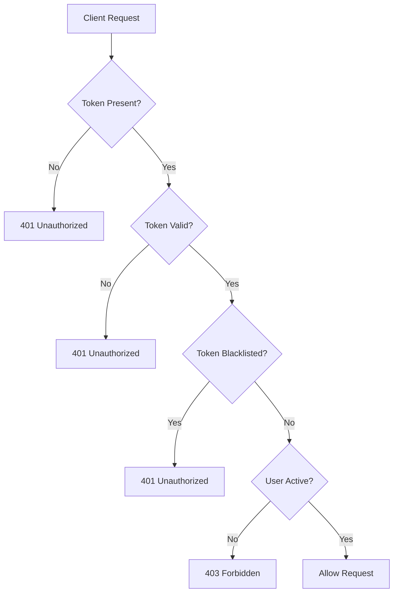

# Library Management System: Authentication and API Guide

## Table of Contents
1. [System Architecture](#system-architecture)
2. [Setup and Configuration](#setup-and-configuration)
3. [Authentication Workflow](#authentication-workflow)
4. [API Endpoints](#api-endpoints)
5. [Implementing JWT in Other Components](#implementing-jwt-in-other-components)
6. [Security Considerations](#security-considerations)
7. [Best Practices](#best-practices)

## System Architecture

### Overview
The Library Management System is built using a modular Flask application with a robust JWT-based authentication system. The architecture is designed to provide:
- Secure authentication
- Role-based access control
- Scalable and maintainable code structure

### Key Components
- **Authentication Service**: Handles user login, token generation, and validation
- **Token Service**: Manages access and refresh tokens
- **Authorization Decorators**: Provide route-level access control
- **Token Blacklist**: Manages token revocation

### Directory Structure
```
library_app/
│
├── app/
│   ├── __init__.py          # App factory and configuration
│   ├── config.py            # Configuration settings
│   ├── models.py            # Database models
│   │
│   ├── routes/
│   │   ├── auth.py          # Authentication routes
│   │   ├── library.py       # Library-related routes
│   │   └── user.py          # User management routes
│   │
│   ├── services/
│   │   ├── token_service.py # Token generation and validation
│   │   └── user_service.py  # User-related business logic
│   │
│   └── utils/
│       ├── decorators.py    # Authentication decorators
│       └── token_blacklist.py # Token revocation management
│
└── run.py                   # Application entry point
```

## Setup and Configuration

### Prerequisites
- Python 3.8+
- Flask
- SQLAlchemy
- PyJWT
- python-dotenv

### Environment Configuration
Create a `.env` file in the project root:

```env
# Security Settings
SECRET_KEY=your_very_long_and_random_secret_key
JWT_ACCESS_TOKEN_EXPIRES=3600  # 1 hour in seconds
JWT_REFRESH_TOKEN_EXPIRES=604800  # 7 days in seconds

# Flask Settings
FLASK_ENV=development
FLASK_DEBUG=true
```

### Installation Steps
1. Create a virtual environment
```bash
python -m venv venv
source venv/bin/activate  # On Windows, use `venv\Scripts\activate`
```

2. Install dependencies
```bash
pip install -r requirements.txt
```

## Authentication Workflow

### Token Types
1. **Access Token**
   - Short-lived (default: 1 hour)
   - Used for authenticating API requests
   - Contains user ID and role

2. **Refresh Token**
   - Longer-lived (default: 7 days)
   - Used to obtain new access tokens
   - Prevents frequent re-authentication

### Login Process
1. User provides credentials
2. Server validates credentials
3. Server generates access and refresh tokens
4. Tokens are returned to the client

### Token Validation Flow


### Test Script

```bash


# Base URL
BASE_URL="http://localhost:5000"

# Login and get tokens
echo "1. Testing Login..."
LOGIN_RESPONSE=$(curl -s -X POST "${BASE_URL}/auth/login" \
  -H "Content-Type: application/json" \
  -d '{
    "username": "jean.dubois@email.com",
    "password": "hashed_password_1"
  }')

# Extract tokens
ACCESS_TOKEN=$(echo $LOGIN_RESPONSE | jq -r '.access_token')
REFRESH_TOKEN=$(echo $LOGIN_RESPONSE | jq -r '.refresh_token')

echo "2. Testing Protected Route..."
curl -s "${BASE_URL}/library/books" \
  -H "Authorization: Bearer ${ACCESS_TOKEN}"

echo "3. Testing Refresh Token..."
curl -s -X POST "${BASE_URL}/auth/refresh" \
  -H "Content-Type: application/json" \
  -d "{\"refresh_token\": \"${REFRESH_TOKEN}\"}"

echo "4. Testing Logout..."
curl -s -X POST "${BASE_URL}/auth/logout" \
  -H "Authorization: Bearer ${ACCESS_TOKEN}"

echo "5. Testing Blacklisted Token..."
curl -s "${BASE_URL}/library/books" \
  -H "Authorization: Bearer ${ACCESS_TOKEN}"

```

## API Endpoints

### Authentication Endpoints
| Endpoint | Method | Description | Authentication Required |
|----------|--------|-------------|------------------------|
| `/auth/login` | POST | User login | No |
| `/auth/refresh` | POST | Refresh access token | No |
| `/auth/logout` | POST | Invalidate current token | Yes |

### Library Endpoints
| Endpoint | Method | Description | Required Role | Authentication |
|----------|--------|-------------|---------------|----------------|
| `/library/books` | GET | List all books | User | Required |
| `/library/books/<id>` | GET | Get book details | User | Required |
| `/library/books/<id>/samples` | GET | Get book samples | User | Required |
| `/library/samples/<id>/borrows` | GET | Get sample borrow history | Librarian | Required + Librarian Role |
| `/library/borrow` | POST | Borrow a book | User | Required |

## Implementing JWT in Other Components

### Adding Authentication to a New Route
```python
from app.utils.decorators import require_auth, require_role

@some_blueprint.route('/protected-route')
@require_auth  # Requires authentication
def protected_route():
    # Route logic here
    pass

@some_blueprint.route('/librarian-only')
@require_role('librarian')  # Requires librarian role
def librarian_route():
    # Librarian-only logic
    pass
```

### Accessing User Information in Routes
```python
from flask import g

@some_route
@require_auth
def some_protected_route():
    user_id = g.user_id  # Current user's ID
    user_role = g.user_role  # Current user's role
```

## Security Considerations

### Token Security
- Use strong, randomly generated secret key
- Never share secret key
- Implement short-lived access tokens
- Use refresh tokens for extended sessions

### Recommended Enhancements
1. Implement rate limiting
2. Add multi-factor authentication
3. Use HTTPS for all communications
4. Implement IP-based blocking for suspicious activities

## Best Practices

### Password Management
- Always hash passwords (use `bcrypt`)
- Never store plain-text passwords
- Implement password complexity requirements

### Token Management
- Implement token rotation
- Allow users to view and revoke active sessions
- Log authentication events

## Troubleshooting

### Common Issues
1. **Invalid Token Errors**
   - Check token expiration
   - Verify secret key
   - Ensure proper token generation

2. **Authentication Failures**
   - Verify user account status
   - Check role permissions
   - Validate credentials

